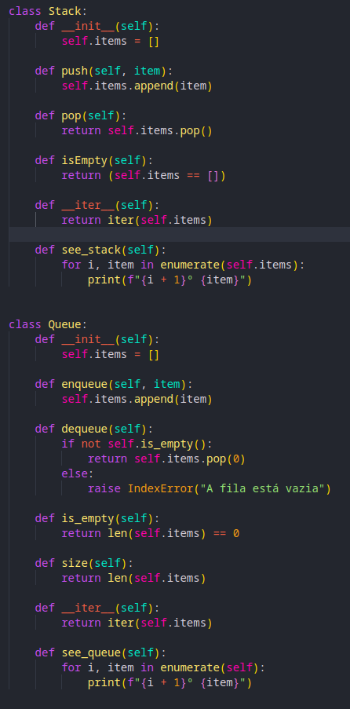

# Trabalho para matéria de Estruturas de Dados

Trabalho para matéria de Estruturas de Dados ministrada pelo professor João Geraldo. Nessa atividade pude aprender como gerenciar estruturas de dados como as Listas, Filas e Pilhas. 

Acima podemos observar as classes Stack e Queue, para podermos gerenciar nosso programa e torná-lo mais fácil de ser utilizado.

